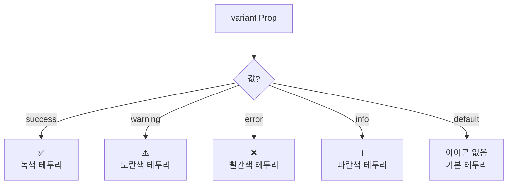

# Dialog 컴포넌트

`Dialog`는 사용자에게 중요한 정보를 전달하거나 특정 액션을 요구할 때 사용하는 대화상자 컴포넌트입니다. `Modal`의 기본 기능 위에 목적에 따른 시각적 변형(`variant`), 정교한 애니메이션, 그리고 의미론적 구조화를 위한 헬퍼 컴포넌트들을 추가하여 더 풍부한 사용자 경험을 제공합니다.

## 주요 기능

- **목적별 시각화**: `variant` prop('success', 'warning', 'error' 등)을 통해 대화상자의 목적을 아이콘과 색상으로 명확하게 전달합니다.
- **정교한 애니메이션**: `Framer Motion`을 사용하여 부드럽고 직관적인 등장/사라짐 애니메이션을 제공합니다.
- **의미론적 구조화**: `DialogHeader`, `DialogTitle`, `DialogDescription`, `DialogFooter`와 같은 헬퍼 컴포넌트를 사용하여 `Dialog`의 내용을 명확하고 일관되게 구성할 수 있습니다.
- **상태 기반 제어**: `Modal`과 동일하게 `isOpen` prop으로 열림/닫힘 상태를 제어하며, ESC키 및 배경 클릭으로 닫는 기능을 지원합니다.
- **Portal 렌더링**: `React Portal`을 사용하여 z-index 문제를 방지합니다.

## `variant`에 따른 시각적 변화

`variant` prop 값에 따라 헤더에 표시되는 아이콘과 전체 테두리 색상이 자동으로 변경됩니다.



## 컴포넌트 구조 (헬퍼 컴포넌트 사용)

`Dialog`는 내부에 `children`으로 자유롭게 콘텐츠를 구성할 수도 있지만, 제공되는 헬퍼 컴포넌트들을 사용하면 더 일관되고 의미 있는 구조를 만들 수 있습니다.

```mermaid
graph TD
    subgraph Dialog
        direction TB
        H(DialogHeader)
        C(Children<br/>(자유 콘텐츠))
        F(DialogFooter)
    end

    subgraph DialogHeader
        T(DialogTitle)
        D(DialogDescription)
    end

    H --> T & D

    style H fill:#f1f5f9
    style F fill:#f1f5f9
    style T fill:#eafaf1
    style D fill:#eafaf1
```

## 사용 시나리오

- **성공/실패 알림**: 작업의 결과를 사용자에게 명확히 알릴 때 `variant="success"` 또는 `variant="error"`를 사용합니다.
- **경고 및 확인**: 삭제나 수정과 같이 되돌릴 수 없는 작업을 수행하기 전에 사용자에게 경고하고 확인을 받을 때 `variant="warning"`을 사용합니다.
- **정보 제공**: 추가적인 설명이나 안내가 필요할 때 `variant="info"`를 사용합니다.
- **복잡한 상호작용**: `DialogFooter`에 여러 버튼을 배치하고, `children`으로 폼(form)과 같은 복잡한 컴포넌트를 넣어 사용자 입력을 받는 데 활용할 수 있습니다.
