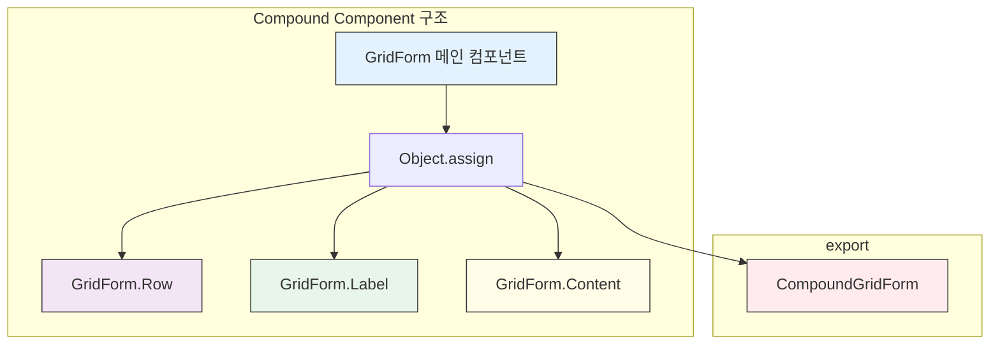
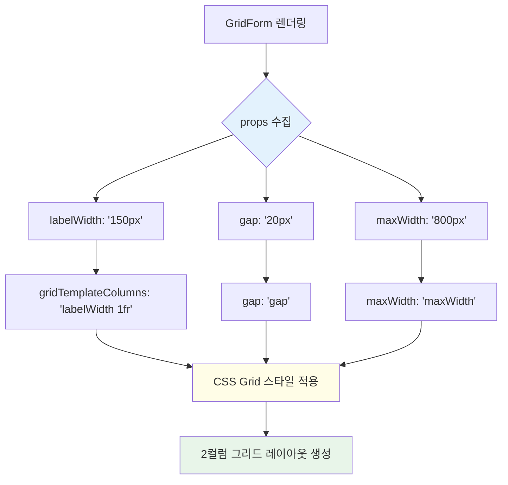
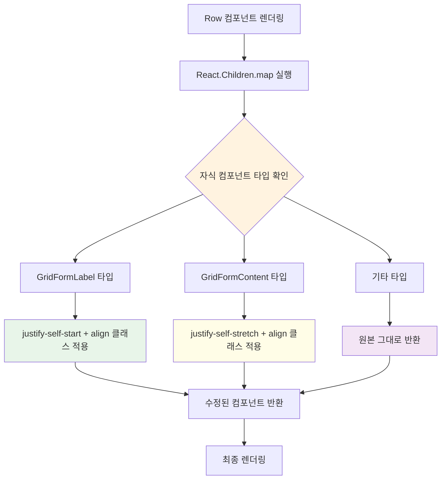
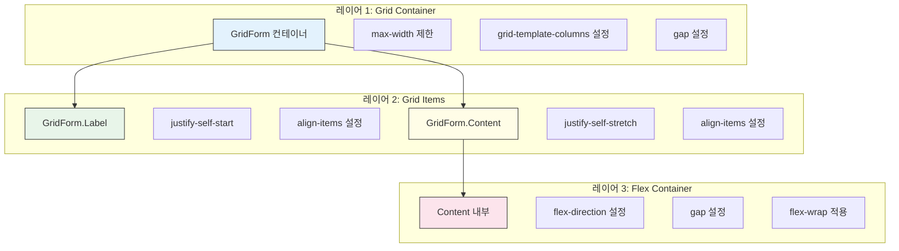
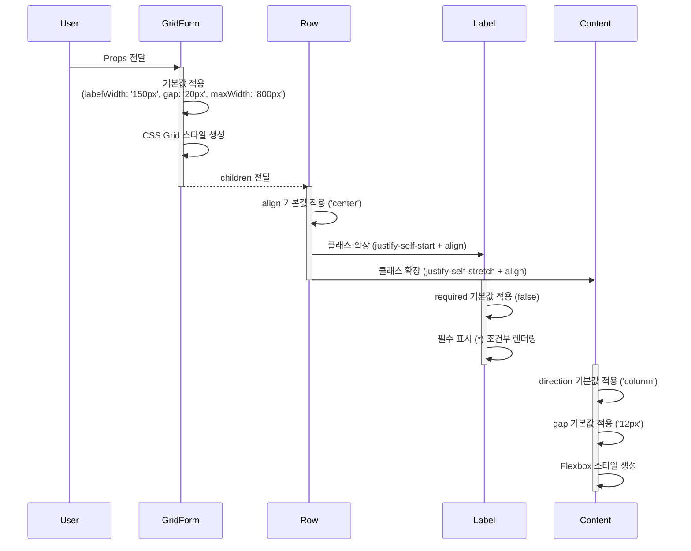

# GridForm 기술 명세

이 문서는 `GridForm` 컴포넌트의 내부 구현과 Compound Component 패턴의 작동 방식을 다이어그램 중심으로 설명합니다.

## 1. Compound Component 구조

`GridForm`은 `Object.assign`을 사용하여 하위 컴포넌트들을 메인 컴포넌트에 연결하는 Compound Component 패턴을 사용합니다.



## 2. CSS Grid 레이아웃 생성 과정

GridForm 컴포넌트는 props를 기반으로 동적 CSS Grid 스타일을 생성합니다.



## 3. Row 컴포넌트의 자식 처리 로직

`GridForm.Row`는 `React.Children.map`을 사용하여 자식 컴포넌트의 타입에 따라 다른 클래스를 적용합니다.



## 4. 스타일 계층 구조

GridForm의 스타일링은 3단계 레이어로 구성됩니다.



## 5. Props 처리 및 기본값 적용

각 컴포넌트는 destructuring과 기본값을 사용하여 props를 처리합니다.



## 6. 타입 안전성

TypeScript 인터페이스를 통해 각 컴포넌트의 props 타입을 엄격하게 정의합니다.

```typescript
// 계층적 인터페이스 구조
interface GridFormProps {
  labelWidth?: string;    // CSS 값
  gap?: string;          // CSS 값  
  maxWidth?: string;     // CSS 값
  className?: string;    // CSS 클래스
  children: React.ReactNode;  // 필수
}

interface GridFormRowProps {
  align?: 'start' | 'center' | 'end';  // 제한된 값
  className?: string;
  children: React.ReactNode;  // 필수
}
```

이 구조는 컴파일 시점에 타입 오류를 방지하고 IDE에서 자동완성을 지원합니다. 