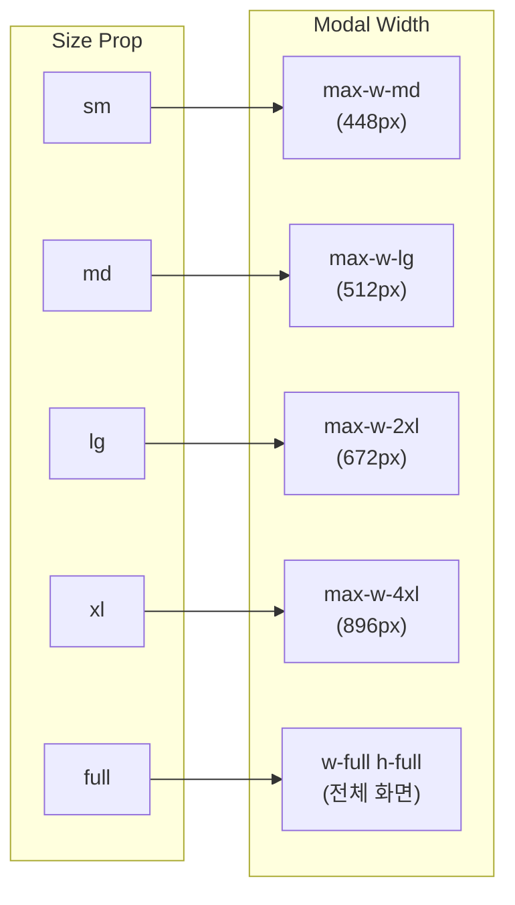
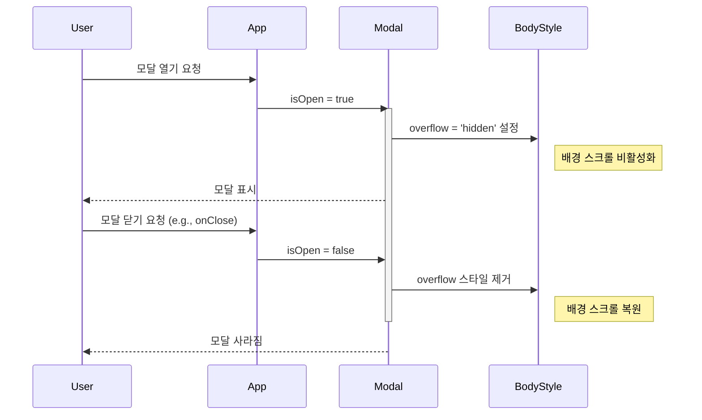

# Modal 기능 명세서

`Modal` 컴포넌트는 현재 페이지 위에 오버레이를 씌워 특정 콘텐츠나 작업에 사용자의 주의를 집중시키는 인터페이스입니다. `React Portal`을 통해 렌더링되어 다른 UI 요소와의 충돌을 방지합니다.

## 1. 핵심 기능 요약

`Modal`은 독립적인 환경을 제공하기 위해 여러 기능을 유기적으로 결합합니다.

```mermaid
graph TD
    A[Modal 열림<br/>(isOpen: true)] --> B{Portal을 통해<br/>body 최상단에 렌더링};
    B --> C[배경 스크롤 잠금<br/>(body.style.overflow = 'hidden')];
    B --> D[콘텐츠 오버레이 표시];
    D --> E[다양한 닫기 옵션 제공];

    subgraph E [닫기 옵션]
        E1[ESC 키]
        E2[배경 클릭]
        E3[닫기 버튼(X)]
    end

    E -- onClose() 호출 --> F[Modal 닫힘<br/>(isOpen: false)];
    F --> G[배경 스크롤 복원];
    F --> H[Portal에서 컴포넌트 제거];
```

## 2. 컴포넌트 구조

`Modal`은 오버레이, 콘텐츠 컨테이너, 그리고 닫기 버튼으로 구성된 계층적 구조를 가집니다.

```mermaid
graph TD
    subgraph "Document Body"
        P[React Portal]
    end

    subgraph "Modal Root (Portal 내부)"
        O[Overlay<br/>(배경, z-index: 9990)]
        C[ModalContainer<br/>(콘텐츠 영역, z-index: 9991)]
    end

    subgraph "ModalContainer 내부"
        CB[CloseButton<br/>(닫기 아이콘)]
        CH[Children<br/>(사용자 정의 콘텐츠)]
    end

    P --> O & C
    C --> CB & CH

    style O fill:#f1f1f1,stroke:#333
    style C fill:#fff,stroke:#333
    style CB fill:#fee,stroke:#c00
```

## 3. 닫기(onClose) 트리거 조건

`onClose` 함수는 `closeOnEscape`와 `closeOnBackdropClick` prop의 설정에 따라 다양한 사용자 행동에 의해 호출될 수 있습니다.

```mermaid
flowchart TD
    subgraph "사용자 행동"
        A[ESC 키 입력]
        B[배경(Overlay) 클릭]
        C[닫기 버튼(X) 클릭]
    end

    subgraph "조건 검사"
        Cond_A{"closeOnEscape: true?"}
        Cond_B{"closeOnBackdropClick: true?"}
    end

    subgraph "액션"
        Action[onClose() 호출]
    end

    A --> Cond_A
    B --> Cond_B
    C --> Action

    Cond_A -- Yes --> Action
    Cond_B -- Yes --> Action
    Cond_A -- No --> EndA[무시]
    Cond_B -- No --> EndB[무시]

    style Action fill:#e7fef9,stroke:#005d5d
```

## 4. 크기 조절 (size Prop)

`size` prop을 사용하여 모달의 너비를 사전 정의된 5가지 크기(`sm`, `md`, `lg`, `xl`, `full`)로 설정할 수 있습니다.



## 5. 배경 스크롤 관리

모달이 열리면(`isOpen: true`) 메인 페이지의 스크롤이 비활성화되고, 닫히면 원래 상태로 복원됩니다.



## 6. 사용 시나리오

- **사용자 확인**: 중요한 작업을 실행하기 전 사용자에게 최종 확인을 받을 때 사용합니다.
- **콘텐츠 상세 보기**: 목록의 항목을 클릭했을 때, 페이지 이동 없이 상세 정보를 보여줍니다.
- **간단한 폼 입력**: 회원가입, 뉴스레터 구독 등 간단한 데이터를 입력받을 때 유용합니다.
