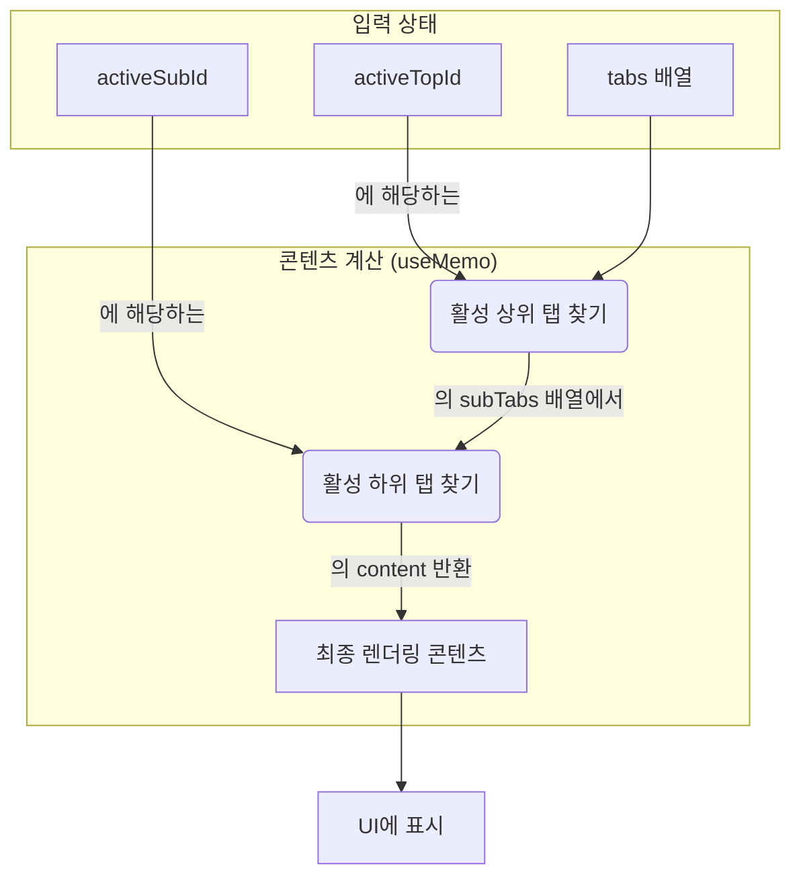

# NestedTabs 기술 명세

이 문서는 `NestedTabs` 컴포넌트의 내부 상태 관리 및 콘텐츠 렌더링 결정 과정을 다이어그램 중심으로 설명합니다.

## 1. 상태 관리 및 업데이트 로직

`NestedTabs`는 `useState`를 사용하여 `activeTopId`와 `activeSubId` 두 가지 상태를 관리합니다. 사용자가 상위 탭을 클릭하면 `handleTopTabClick` 함수가 실행되어 두 상태가 연쇄적으로 업데이트됩니다.

```mermaid
flowchart TD
    Start[상위 탭 클릭] --> A(handleTopTabClick 실행);
    A --> B{setActiveTopId(클릭된_ID)};
    B --> C{클릭된 상위 탭의<br/>첫 번째 하위 탭 ID 탐색};
    C --> D{setActiveSubId(찾은_하위탭_ID)};
    D --> E[리렌더링];
    E --> End;

    style B fill:#eafaf1
    style D fill:#fef9e7
```

## 2. 렌더링 콘텐츠 결정 플로우

화면에 표시될 최종 콘텐츠는 `useMemo` 훅을 사용하여 `activeTopId`와 `activeSubId`가 변경될 때만 재계산됩니다. 이는 불필요한 렌더링을 방지하고 성능을 최적화합니다.



## 3. 하위 컴포넌트 데이터 흐름

`NestedTabs` 컴포넌트는 계산된 상태와 데이터를 기반으로 하위 UI 영역(상위 탭, 하위 탭, 콘텐츠)을 렌더링합니다.

```mermaid
graph TD
    subgraph "상태 및 계산된 데이터"
        A[activeTopId]
        B[activeSubId]
        C[activeTopTab (useMemo)]
        D[activeSubTabContent (useMemo)]
    end

    subgraph "UI 영역"
        E(상위 탭 목록)
        F(하위 탭 목록)
        G(콘텐츠 영역)
    end

    A --> E
    B & C --> F
    D --> G

    style E fill:#f1f5f9
    style F fill:#f1f5f9
    style G fill:#fef9e7
```

- **상위 탭 목록**: `activeTopId`를 사용하여 현재 활성화된 탭에 스타일을 적용합니다.
- **하위 탭 목록**: `activeTopTab` 데이터와 `activeSubId`를 사용하여 현재 활성화된 하위 탭에 스타일을 적용합니다.
- **콘텐츠 영역**: `activeSubTabContent`에 저장된 React 노드를 직접 렌더링합니다.
