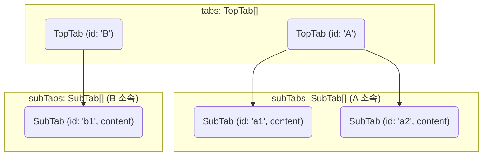
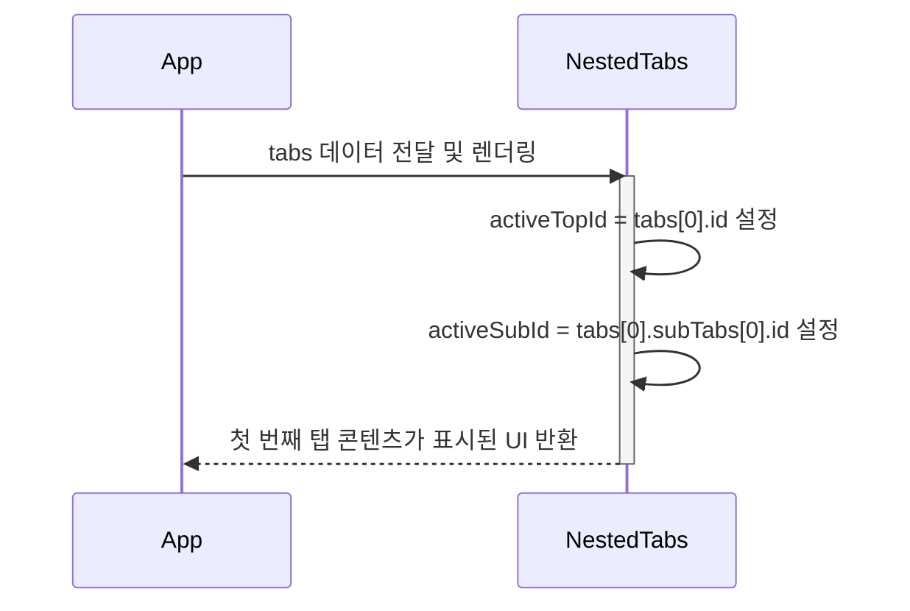
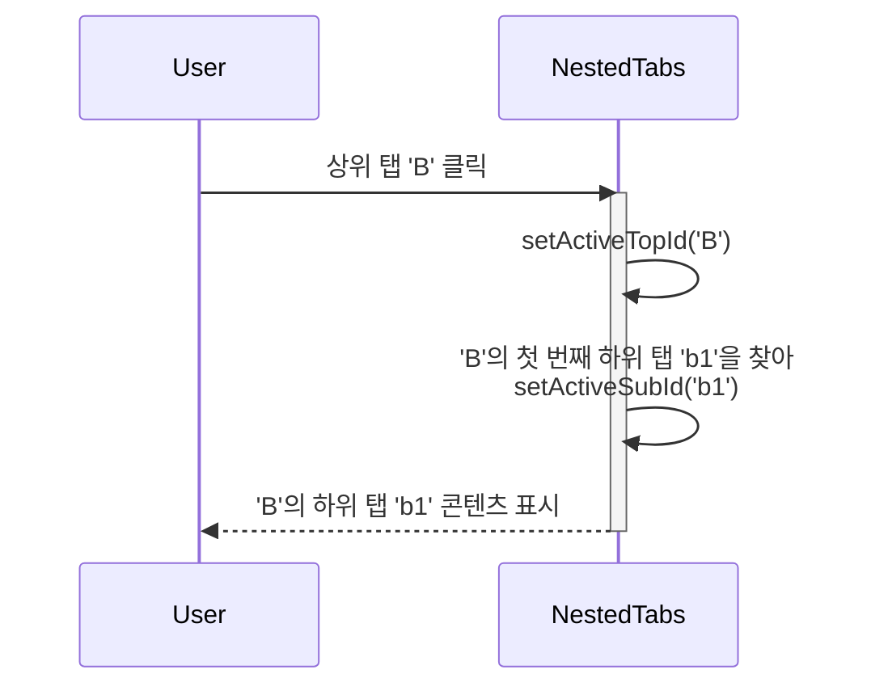
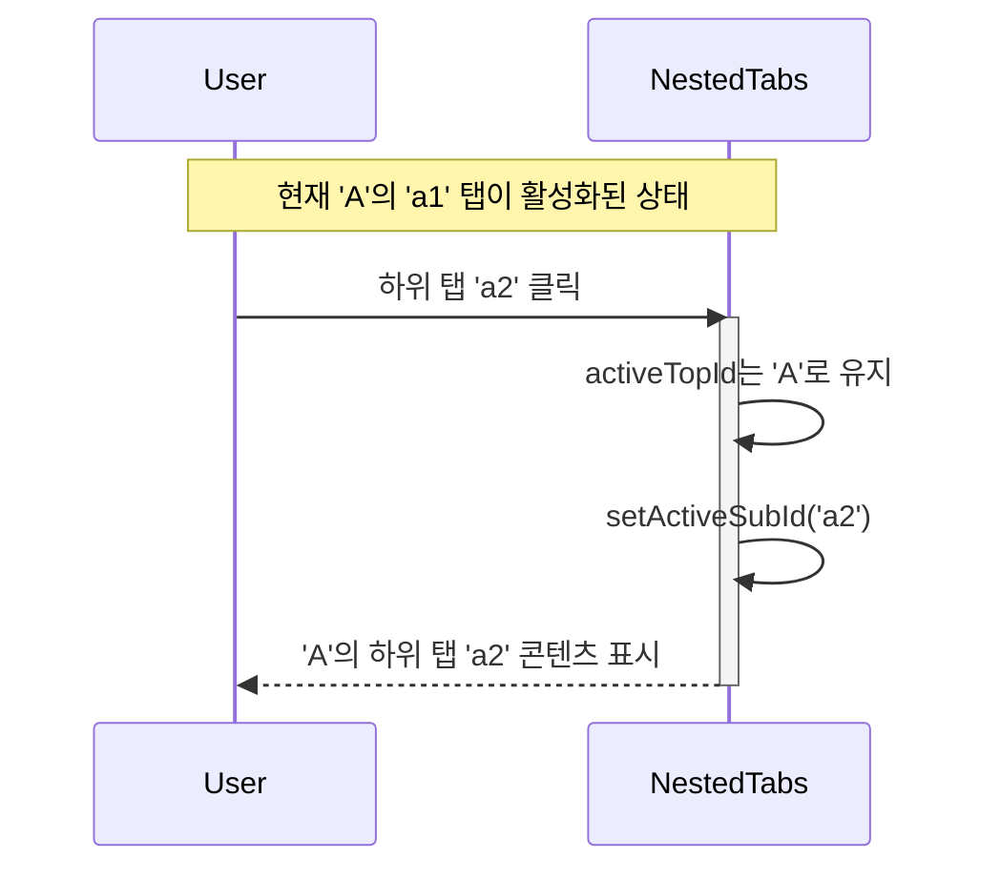

# NestedTabs 기능 명세서

`NestedTabs`는 2단계 계층 구조를 가진 콘텐츠를 효과적으로 탐색하고 표시하기 위한 컴포넌트입니다. 상위 탭으로 큰 카테고리를, 하위 탭으로 세부 항목을 나누어 복잡한 정보를 체계적으로 정리할 수 있습니다.

## 1. UI 레이아웃 구성

컴포넌트는 상위 탭 목록, 하위 탭 목록, 그리고 선택된 콘텐츠 영역, 세 부분으로 구성됩니다.

```mermaid
graph TD
    subgraph "NestedTabs Component"
        direction LR
        A[TopTabsList<br>(상위 탭 목록)] --> B[SubTabsList<br>(하위 탭 목록)];
        B --> C[ContentDisplay<br>(선택된 하위 탭의 콘텐츠)];
    end

    style A fill:#e3f2fd,stroke:#333
    style B fill:#e8f5e9,stroke:#333
    style C fill:#fffde7,stroke:#333
```

## 2. 데이터 구조

`NestedTabs`는 `TopTab` 객체의 배열을 `tabs` prop으로 받습니다. 각 `TopTab`은 하위 탭인 `SubTab`의 배열을 포함하여 중첩 구조를 형성합니다.



## 3. 상태 변경 및 렌더링 흐름

`NestedTabs`는 현재 활성화된 상위 탭(`activeTopId`)과 하위 탭(`activeSubId`)의 상태를 내부적으로 관리하며, 사용자의 상호작용에 따라 연동하여 변경됩니다.

### 시나리오 1: 초기 렌더링

컴포넌트가 처음 로드되면, `tabs` prop으로 받은 데이터의 첫 번째 상위 탭과 그에 속한 첫 번째 하위 탭이 자동으로 활성화됩니다.



### 시나리오 2: 상위 탭 클릭

사용자가 다른 상위 탭을 클릭하면, 해당 탭이 활성화되고 그에 속한 **첫 번째 하위 탭**이 자동으로 선택됩니다.



### 시나리오 3: 하위 탭 클릭

사용자가 현재 활성화된 상위 탭 내에서 다른 하위 탭을 클릭하면, 상위 탭은 그대로 유지되고 하위 탭만 변경됩니다.



## 4. 사용 사례

- **복잡한 설정 페이지**: '계정 설정' > '프로필', '보안', '알림'
- **제품 상세 정보**: '제품 사양' > '하드웨어', '소프트웨어', '액세서리'
- **관리자 대시보드**: '사용자 관리' > '활성 사용자', '비활성 사용자', '권한 설정'
