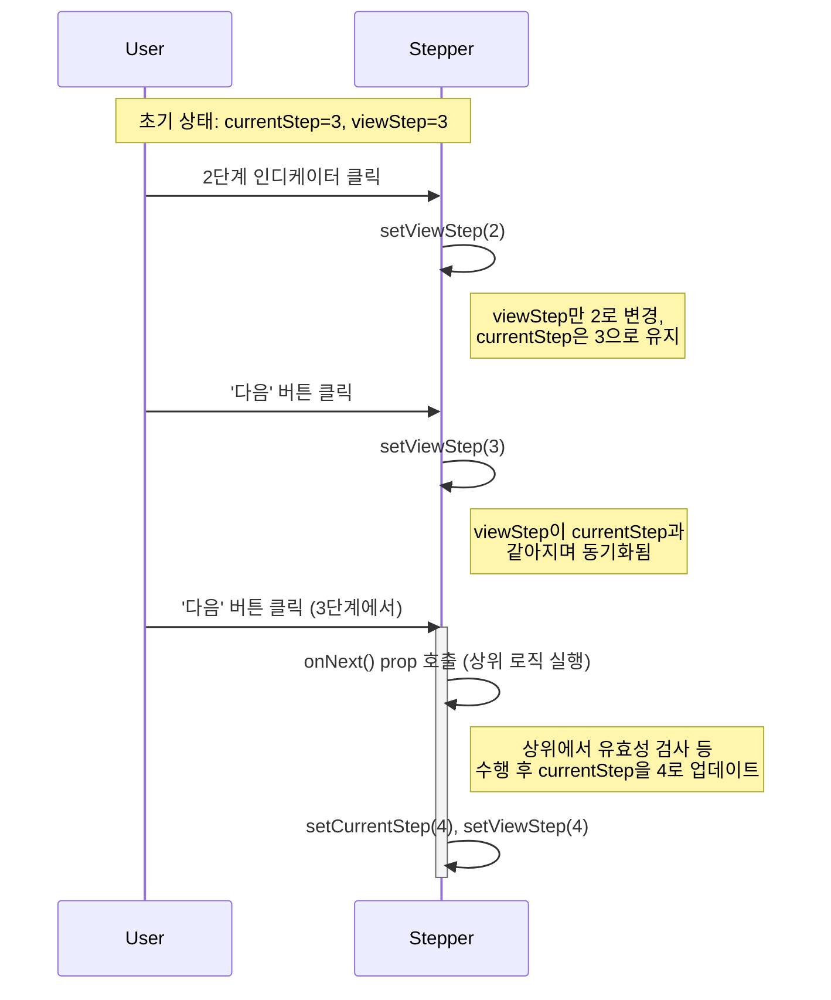
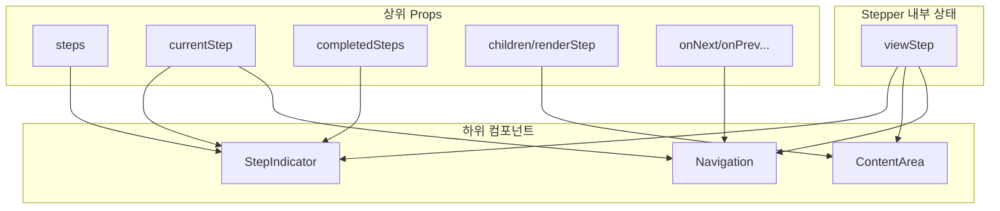

# Stepper 기술 명세서

이 문서는 `Stepper` 컴포넌트와 그 하위 컴포넌트들의 핵심 로직, 상태 관리, 렌더링 방식을 다이어그램 중심으로 설명합니다.

## 1. 핵심 상태: `currentStep` vs `viewStep`

`Stepper`는 두 가지 다른 "단계" 상태를 내부적으로 관리하여, 실제 진행 상황과 현재 사용자가 보고 있는 화면을 분리합니다. 이를 통해 사용자는 이미 완료한 과거 단계를 자유롭게 다시 확인할 수 있습니다.

- **`currentStep`**: 프로세스가 **실제로 완료된** 마지막 단계를 의미합니다. (예: 4단계 양식을 제출함)
- **`viewStep`**: 사용자가 **현재 화면에서 보고 있는** 단계를 의미합니다. (예: 2단계 정보를 다시 확인함)

### 상태 변경 시나리오



## 2. 콘텐츠 렌더링 전략

`Stepper`는 `children`과 `renderStep` 두 가지 방식으로 콘텐츠를 렌더링하며, `renderStep` prop이 존재할 경우 우선적으로 사용합니다.

```mermaid
flowchart TD
    A[viewStep 변경] --> B{renderStep prop 존재?};
    B -- Yes --> C[renderStep(viewStep) 호출<br>및 반환값 렌더링];
    B -- No --> D{children prop 존재?};
    D -- Yes --> E["React.Children.toArray(children)<br>[viewStep] 선택 및 렌더링"];
    D -- No --> F[콘텐츠 없음];
    C & E & F --> G[ContentArea에 표시];
```

## 3. `StepIndicator` 동적 렌더링 로직

단계 표시기는 `maxVisibleSteps` prop을 기준으로 표시할 단계의 범위를 동적으로 계산합니다. `viewStep`이 항상 중앙 부근에 위치하도록 조정하여 많은 단계가 있을 때도 깔끔한 UI를 유지합니다.

```mermaid
flowchart TD
    Start[렌더링 시작] --> A{전체 단계 수 > maxVisibleSteps?};
    A -- No --> B[모든 단계 표시];
    A -- Yes --> C{계산된 시작점 = max(0, viewStep - floor(max/2))};
    C --> D{계산된 끝점 = min(총 단계 수, 시작점 + maxVisibleSteps)};
    D --> E[시작점 ~ 끝점 범위의 단계만 렌더링];
    B & E --> End[UI에 표시];
```

## 4. `Navigation` 버튼 활성화 로직

이전/다음 버튼의 활성화 여부는 `viewStep`과 `currentStep`, 그리고 단계 완료 여부를 복합적으로 고려하여 결정됩니다.

```mermaid
graph TD
    subgraph "입력 상태"
        A[viewStep]
        B[currentStep]
        C[isStepCompleted(viewStep)]
        D[totalSteps]
    end

    subgraph "로직"
        P{"이전 버튼<br>(viewStep > 0)"}
        N{"다음 버튼<br>(viewStep < totalSteps - 1)"}
    end

    subgraph "출력"
        Prev[이전 버튼 활성화/비활성화]
        Next[다음 버튼 활성화/비활성화]
    end

    A --> P
    A & B & C & D --> N

    P -- Yes --> Prev
    N --"조건 만족 시"--> Next
```

- **다음 버튼 활성화 조건**: `viewStep`이 `currentStep`보다 작거나, 현재 `viewStep`이 이미 완료된 단계(`isStepCompleted(viewStep)`)일 때만 활성화됩니다. 이를 통해 사용자가 아직 진행하지 않은 미래의 단계로 넘어가는 것을 방지합니다.

## 5. 데이터 흐름 종합

`Stepper` 컨테이너는 상위 컴포넌트로부터 받은 props와 내부적으로 관리하는 `viewStep` 상태를 조합하여 각 하위 컴포넌트에 필요한 데이터를 전달합니다.


