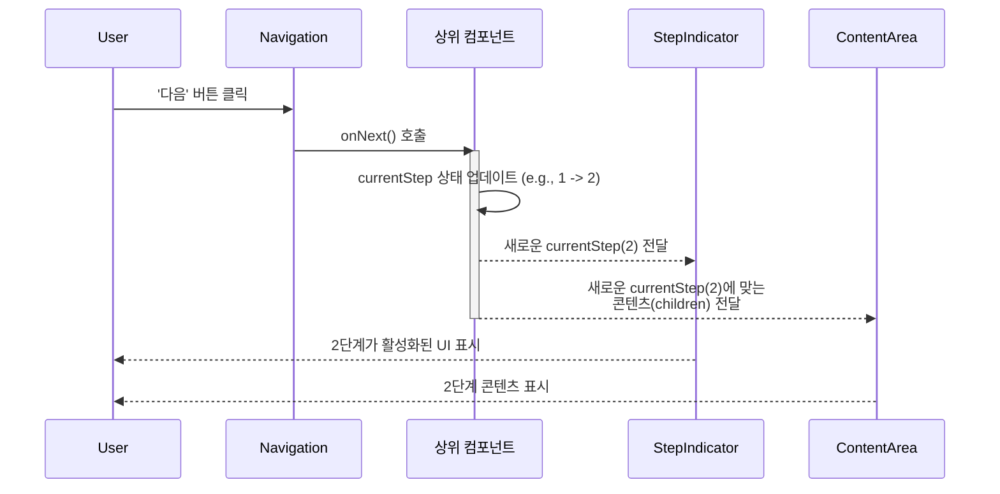

# Stepper 기능 명세서

`Stepper`는 여러 단계로 구성된 작업을 순차적으로 안내하고, 사용자의 진행 상황을 시각적으로 표현하는 복합 컴포넌트입니다. 회원 가입, 양식 작성, 설정 과정 등 명확한 순서가 있는 모든 프로세스에 적용할 수 있습니다.

## 1. 컴포넌트 아키텍처

`Stepper`는 상태를 표시하는 `StepIndicator`, 콘텐츠를 보여주는 `ContentArea`, 그리고 단계를 이동하는 `Navigation`의 세 부분으로 구성된 제어 컴포넌트(Controlled Component)입니다.

```mermaid
graph TD
    subgraph "상위 컴포넌트 (상태 관리)"
        State[currentStep: number<br/>completedSteps: number[]<br/>steps: string[]]
        Handlers[onNext(), onPrev(), onComplete()]
    end

    subgraph "Stepper 컴포넌트 (UI 표시)"
        A[StepIndicator]
        B[ContentArea]
        C[Navigation]
    end

    State -- Props 전달 --> Stepper
    Handlers -- Props 전달 --> C

    Stepper -- 구성 --> A & B & C

    style State fill:#e3f2fd,stroke:#333
    style Handlers fill:#e8f5e9,stroke:#333
    style Stepper fill:#f1f5f9,stroke:#666
```

- **상위 컴포넌트**: 실제 단계 데이터와 현재 진행 상태, 상태 변경 로직을 모두 관리합니다.
- **`Stepper`**: 전달받은 상태(Props)를 기반으로 UI를 그리는 역할만 담당합니다.

## 2. 핵심 동작 흐름 (제어 컴포넌트 패턴)

사용자가 `Stepper`의 네비게이션 버튼을 클릭하면, `Stepper`는 상태를 직접 바꾸지 않고 상위 컴포넌트에 정의된 핸들러 함수를 호출합니다. 상태 변경의 책임은 전적으로 상위 컴포넌트에 있습니다.



이 구조는 각 단계마다 비동기 데이터 로딩이나 유효성 검사 같은 복잡한 로직을 자유롭게 추가할 수 있는 유연성을 제공합니다.

## 3. 단계 표시기(StepIndicator) 상태

`StepIndicator`는 `currentStep`과 `completedSteps` prop을 조합하여 각 단계의 상태를 세 가지(완료, 현재, 미완료)로 시각화합니다.

```mermaid
graph LR
    subgraph "입력 Props"
        A[currentStep: 2]
        B[completedSteps: [0, 1]]
    end

    subgraph "단계별 상태 결정 로직"
        C{"index < currentStep<br/>(e.g., 단계 0, 1)"} -- Yes --> D[완료 (Completed)]
        C -- No --> E{"index === currentStep<br/>(e.g., 단계 2)"}
        E -- Yes --> F[현재 (Current)]
        E -- No --> G{"index > currentStep<br/>(e.g., 단계 3, 4)"}
        G -- Yes --> H[미완료 (Pending)]
    end

    subgraph "UI 표현"
        IconD[✔ 아이콘]
        IconF[숫자 '3']
        IconH[숫자 '4', '5']
    end

    A & B --> C
    D --> IconD
    F --> IconF
    H --> IconH
```

## 4. 사용 시나리오

- **온보딩 튜토리얼**: 신규 사용자에게 서비스의 핵심 기능을 단계별로 안내합니다.
- **다단계 폼**: 긴 양식을 '개인 정보', '주소 입력', '결제 정보' 등 여러 단계로 나누어 사용자의 피로감을 줄입니다.
- **설치 마법사**: 소프트웨어나 애플리케이션의 설치 과정을 단계별로 안내하고 설정 옵션을 받습니다.
