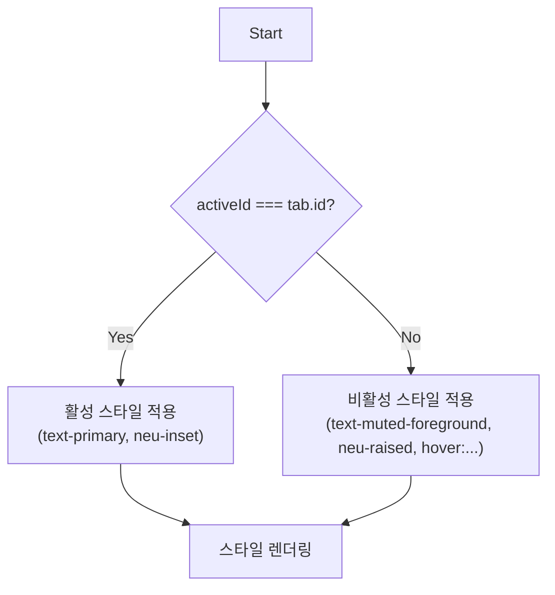
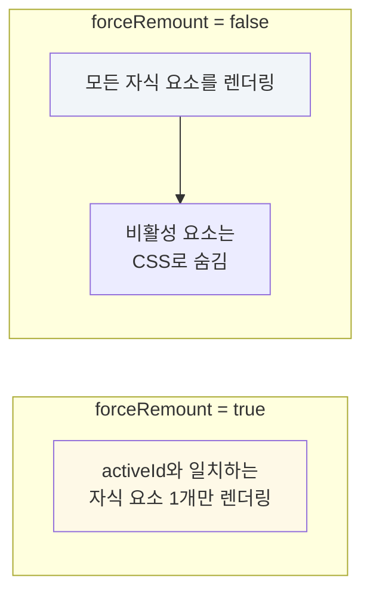

# Tabs 기술 명세

이 문서는 `Tabs` 컴포넌트의 내부 상태 관리 및 동적 스타일링 로직을 다이어그램 중심으로 설명합니다.

## 1. 내부 상태 관리

`Tabs` 컴포넌트는 `useState` 훅을 사용하여 현재 활성화된 탭의 `id`를 `activeId`라는 내부 상태로 관리합니다. 초기값은 `tabs` 배열의 첫 번째 요소 `id`로 설정됩니다. 사용자가 탭 버튼을 클릭하면 `setActiveId`가 호출되어 상태가 변경되고, 이에 따라 컴포넌트가 리렌더링됩니다.

```mermaid
graph TD
    A[컴포넌트 마운트] --> B(useState(tabs[0].id));
    B --> C{activeId};
    D[탭 버튼 클릭] -- onClick(tab.id) --> E(setActiveId);
    E --> C;
    C -- "활성 탭 결정" --> F[UI 리렌더링];

    style C fill:#e6f3ff
```

## 2. 탭 버튼 스타일 결정 로직

각 탭 버튼의 스타일은 현재 `activeId`와 해당 버튼의 `tab.id`가 일치하는지에 따라 조건부로 결정됩니다.



## 3. `forceRemount`에 따른 콘텐츠 렌더링 플로우

`forceRemount` prop은 탭 콘텐츠의 렌더링 방식을 제어합니다.

- **`true` (기본값)**: JavaScript의 `map`과 삼항 연산자를 사용하여 `activeId`와 일치하는 `id`를 가진 `children` 요소만 렌더링하고 나머지는 `null`을 반환합니다. 이는 비활성 탭 컴포넌트의 완전한 언마운트를 보장합니다.
- **`false`**: 모든 `children`을 렌더링하되, `activeId`와 `id`가 일치하지 않는 요소에는 `hidden` 클래스를 적용하여 CSS `display: none`으로 화면에서 숨깁니다.


