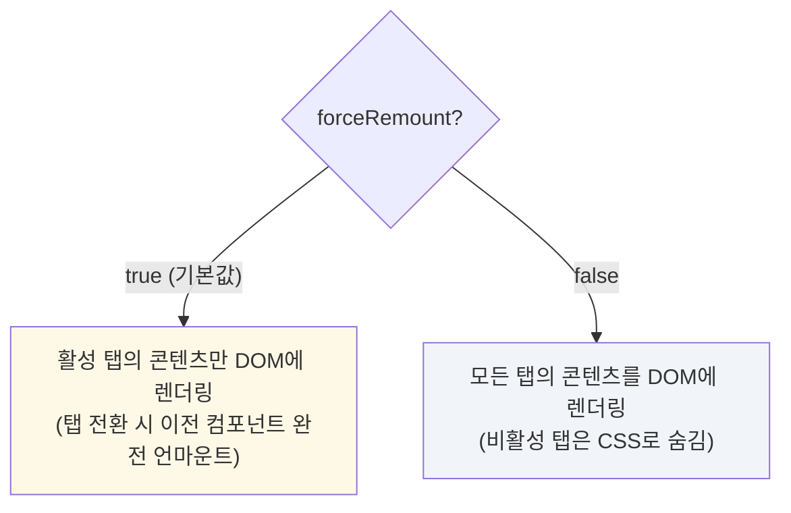

# Tabs 컴포넌트

`Tabs`는 관련된 콘텐츠 그룹을 분리하여 사용자가 선택적으로 탐색할 수 있도록 하는 UI 컴포넌트입니다. 클릭 가능한 탭 헤더와 해당 콘텐츠 패널로 구성되며, 자체적으로 활성 탭 상태를 관리합니다.

## 주요 기능

- **자체 상태 관리**: 현재 활성화된 탭의 상태를 내부적으로 관리하여 사용이 간편합니다.
- **다양한 스타일 옵션**: `variant`, `align`, `size` prop을 통해 탭 헤더의 모양과 정렬, 크기를 쉽게 변경할 수 있습니다.
- **아이콘 지원**: 각 탭의 라벨 옆에 `icon`을 추가하여 시각적 구분을 더할 수 있습니다.
- **콘텐츠 렌더링 제어**: `forceRemount` prop을 통해 비활성 탭의 콘텐츠를 DOM에서 완전히 제거할지, 아니면 단순히 숨길지 선택할 수 있습니다. 이는 Three.js와 같이 캔버스 컨텍스트를 완전히 해제해야 하는 컴포넌트를 사용할 때 유용합니다.

## 컴포넌트 구조

`Tabs` 컴포넌트는 `tabs` 배열과 `children` 배열을 props로 받습니다. `tabs` 배열은 탭 헤더를, `children` 배열은 각 탭에 해당하는 콘텐츠를 정의하며, 두 배열의 순서는 일치해야 합니다.

```mermaid
graph TD
    subgraph "Tabs Props"
        A[tabs: Tab[]] --> C(탭 헤더 UI)
        B[children: React.ReactNode[]] --> D(탭 콘텐츠 UI)
    end

    subgraph "Tab 객체"
        E[id: string]
        F[label: string]
        G[icon?: React.ReactNode]
    end

    A -- 포함 --> E & F & G
    C -- "클릭 시<br/>activeId 변경" --> D

    style A fill:#eafaf1
    style B fill:#eafaf1
```

## 콘텐츠 렌더링 방식 (`forceRemount`)

`forceRemount` prop 값에 따라 탭 콘텐츠가 렌더링되는 방식이 달라집니다.



## 사용 시나리오

- **일반 콘텐츠 분리**: 설정 페이지, 사용자 프로필 등 여러 섹션으로 구성된 정보를 깔끔하게 정리하고 싶을 때 사용합니다.
- **메모리 집약적 콘텐츠 관리**: 각 탭에 Three.js 캔버스, 무거운 차트, 비디오 플레이어 등 리소스를 많이 사용하는 컴포넌트가 있을 경우 `forceRemount={true}` 옵션을 사용하여 비활성 탭의 리소스를 완전히 해제하고 성능을 최적화할 수 있습니다.
