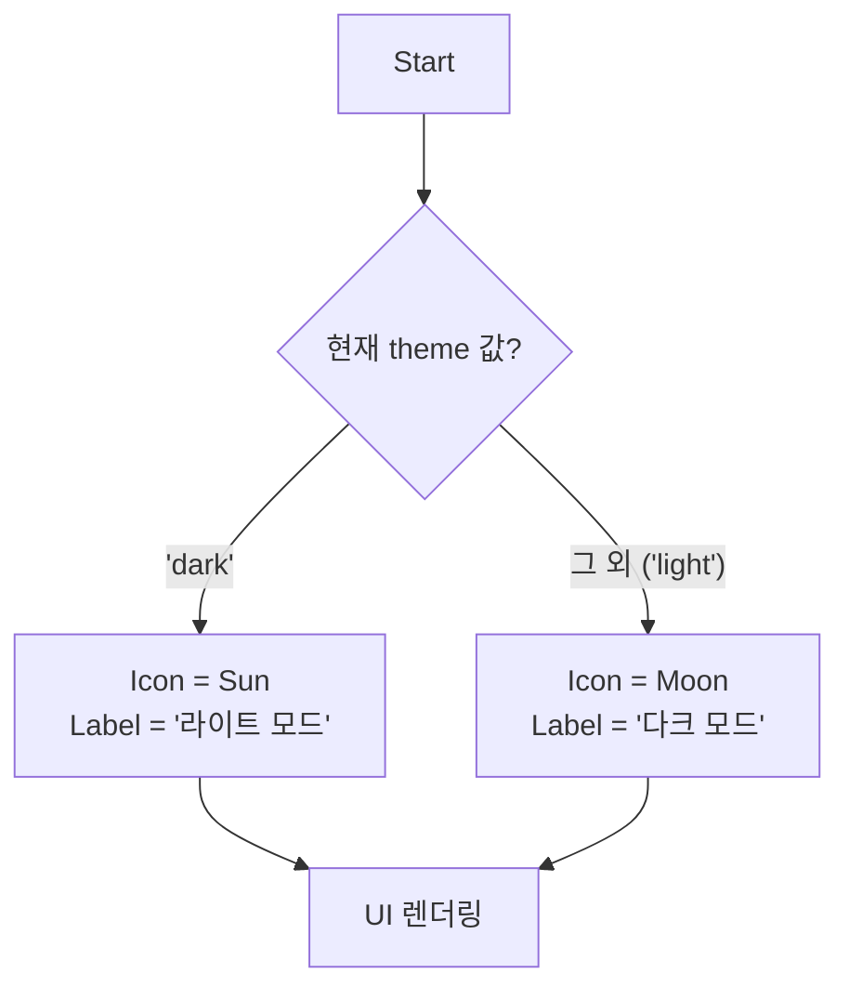

# ThemeToggle 기술 명세

이 문서는 `ThemeToggle` 컴포넌트의 내부 상태 관리 의존성 및 렌더링 로직을 다이어그램 중심으로 설명합니다.

## 1. 상태 관리 의존성 (Jotai)

`ThemeToggle`은 `jotai` 아톰(atom)을 사용하여 전역 테마 상태를 관리합니다. 컴포넌트는 테마 상태를 읽고, 상태를 토글하며, 마운트 시 초기화하는 역할을 담당하는 아톰에 의존합니다.

```mermaid
graph TD
    subgraph "Jotai Atoms (src/store/theme.ts)"
        A[themeAtom<br/>(읽기용)]
        B[toggleThemeAtom<br/>(쓰기용)]
        C[initThemeAtom<br/>(초기화용)]
    end

    subgraph "ThemeToggle Component"
        D{UI & Logic}
    end

    A -- "현재 테마 상태 제공" --> D
    D -- "버튼 클릭 시 실행" --> B
    D -- "컴포넌트 마운트 시 실행" --> C

    style A fill:#eafaf1
    style B fill:#fef9e7
    style C fill:#fdebd0
```

## 2. 동적 아이콘 및 라벨 결정 플로우

버튼에 표시되는 아이콘과 텍스트 라벨은 현재 `theme` 상태 값에 따라 동적으로 결정됩니다.



## 3. 스타일 클래스 적용 로직

최종적으로 버튼에 적용될 CSS 클래스는 `className` prop의 존재 여부에 따라 결정됩니다. `className`이 제공되면 `variantClasses`는 무시됩니다.

```mermaid
flowchart TD
    Start --> A{className prop이<br/>제공되었는가?};
    A -- "Yes" --> B["최종 클래스 =<br/>baseClasses + className"];
    A -- "No" --> C["최종 클래스 =<br/>baseClasses + variantClasses[variant]"];
    B & C --> End[clsx()로 클래스 병합];
```
