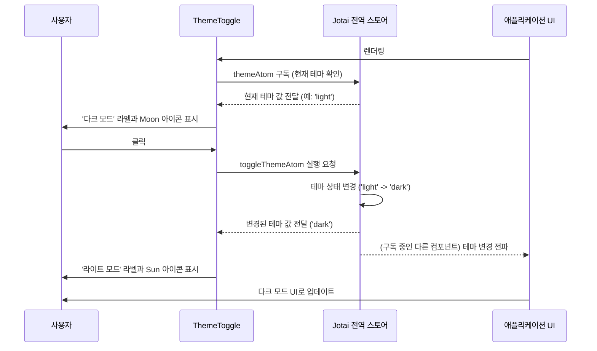
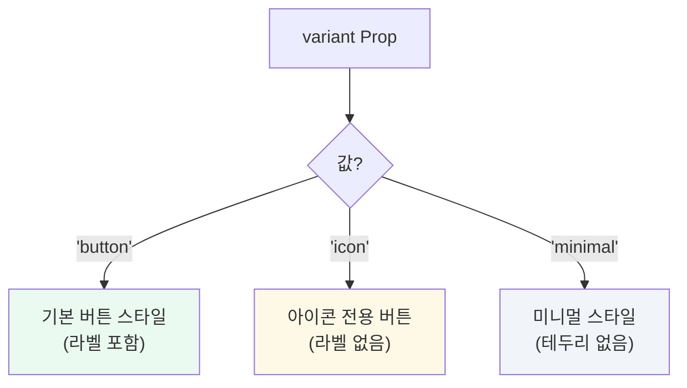

# ThemeToggle 컴포넌트

`ThemeToggle`은 애플리케이션의 라이트 모드와 다크 모드를 전환하는 UI 컨트롤을 제공하는 컴포넌트입니다. `jotai`를 사용하여 전역 테마 상태를 관리하며, 사용자가 버튼을 클릭하면 즉시 전체 UI의 테마가 변경됩니다.

## 주요 기능

- **테마 전환**: 클릭 시 라이트/다크 모드를 토글합니다.
- **동적 UI**: 현재 테마에 따라 아이콘(`Sun`/`Moon`)과 라벨(`라이트 모드`/`다크 모드`)이 자동으로 변경됩니다.
- **다양한 스타일**: `variant` prop을 통해 세 가지 다른 스타일('button', 'icon', 'minimal')로 렌더링할 수 있어, UI의 다양한 위치에 자연스럽게 배치할 수 있습니다.
- **상태 동기화**: `jotai` 전역 상태를 사용하여 애플리케이션의 다른 부분과 테마 상태를 일관되게 유지합니다.

## 컴포넌트 동작 및 상태 흐름

`ThemeToggle`은 `jotai`의 `themeAtom`을 구독하여 현재 테마 상태를 가져오고, `toggleThemeAtom`을 사용하여 상태 변경을 요청합니다.

## `variant` 별 스타일

`variant` prop을 통해 버튼의 외형을 쉽게 변경할 수 있습니다.

## 사용 시나리오

헤더, 사이드바, 설정 페이지 등 사용자가 테마를 변경할 것으로 기대하는 모든 위치에 사용할 수 있습니다. `variant`와 `showLabel` prop을 조합하여 주변 UI와 가장 잘 어울리는 형태로 배치하는 것이 좋습니다.
