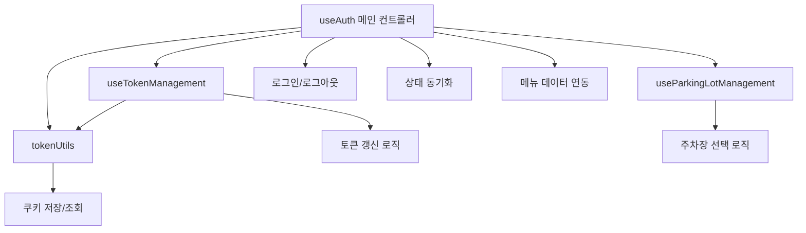
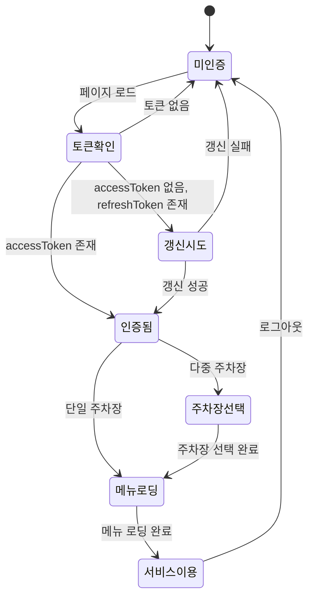
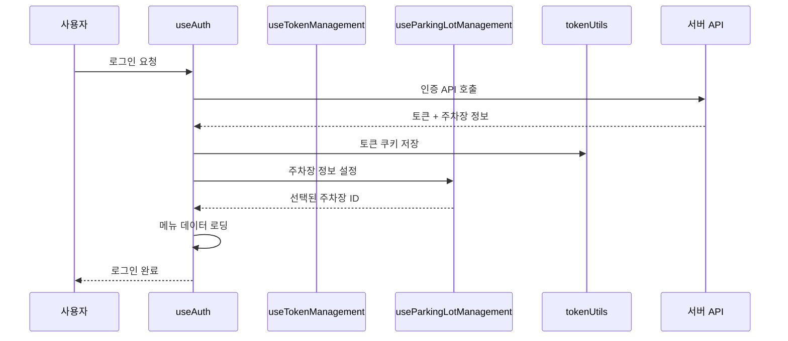

# useAuth 시스템 작동 기전

## 개요
`useAuth` 시스템은 4개의 독립적인 모듈로 구성된 인증 관리 시스템이다. 각 모듈은 단일 책임 원칙에 따라 명확한 역할을 담당한다.

## 시스템 아키텍처

### 모듈 구성
- **useAuth.ts** (메인 컨트롤러) - 전체 인증 흐름 조율
- **useTokenManagement.ts** - 토큰 갱신 및 관리
- **useParkingLotManagement.ts** - 주차장 선택 및 정보 관리
- **tokenUtils.ts** - 쿠키 기반 토큰 저장소

### 의존성 관계



## 인증 플로우

### 전체 상태 다이어그램



### 1. 초기 상태 확인 플로우

```
페이지 로드
    ↓
쿠키에서 accessToken 확인
    ↓
[있음] → 로그인 상태로 설정
    ↓
[없음] → refreshToken 확인
    ↓
[있음] → 토큰 갱신 시도
    ↓
[성공] → 로그인 상태 복원
[실패] → 로그아웃 상태
```

### 2. 로그인 플로우



### 3. 로그아웃 플로우

```
로그아웃 요청
    ↓
서버 로그아웃 API 호출
    ↓
모든 토큰 쿠키 삭제
    ↓
전역 상태 초기화
    ↓
로그아웃 완료
```

## 토큰 관리 시스템

### 토큰 갱신 수도코드

```
function refreshToken():
    refreshToken = 쿠키에서_리프레시토큰_조회()
    
    if refreshToken이_없음:
        return false
        
    try:
        result = 서버_토큰갱신_요청(refreshToken)
        
        if 갱신_성공:
            새로운_토큰들을_쿠키에_저장()
            주차장_정보_업데이트()
            메뉴_데이터_재로딩()
            return true
        else:
            return false
    catch:
        return false
```

### 토큰 생명주기

```
accessToken (24시간)
    ↓
만료 감지
    ↓
refreshToken으로 갱신
    ↓
새로운 accessToken 발급
    ↓
쿠키 업데이트
```

## 주차장 관리 시스템

### 주차장 선택 로직

```
function 주차장_초기설정(parkinglots, parkingLotId):
    if parkingLotId가_명시됨:
        선택된_주차장 = parkingLotId
    else if 주차장이_1개:
        선택된_주차장 = 첫번째_주차장.id
    else if 주차장이_여러개:
        선택된_주차장 = 0  // 선택 대기 상태
    
    메뉴_데이터_로딩(선택된_주차장)
```

### 주차장 상태 관리

```
selectedParkingLotId 값의 의미:
- null: 미인증 상태
- 0: 다중 주차장 환경에서 선택 대기
- 양수: 특정 주차장 선택됨
```

## 상태 동기화 메커니즘

### useEffect 기반 동기화

```
Effect 1: 토큰-로그인상태 동기화
    쿠키 토큰 ↔ isLoggedIn 상태 일치 확인
    불일치 시 토큰 갱신 또는 로그아웃 처리

Effect 2: 로그인-메뉴 동기화  
    로그인 상태 + 주차장 선택 완료 시
    → 해당 주차장 메뉴 데이터 로딩
```

## 에러 처리 전략

### 토큰 관련 에러

```
accessToken 없음
    ↓
refreshToken 확인
    ↓
[있음] → 갱신 시도
[없음] → 즉시 로그아웃

refreshToken 갱신 실패
    ↓
자동 로그아웃 처리
    ↓
사용자에게 재로그인 요구
```

### 네트워크 에러

```
API 호출 실패
    ↓
에러 메시지 반환
    ↓
UI에서 에러 표시
    ↓
사용자 재시도 가능
```

## 보안 고려사항

### 토큰 저장
- **httpOnly 쿠키 미사용**: 클라이언트에서 토큰 조작 필요
- **max-age 설정**: 24시간 자동 만료
- **path 제한**: `/` 경로로 제한

### 자동 갱신
- **백그라운드 갱신**: 사용자 인터랙션 없이 자동 처리
- **갱신 실패 시**: 즉시 로그아웃으로 보안 유지

## 확장성 설계

### 훅 분리의 장점
1. **독립적 테스트**: 각 훅을 개별 테스트 가능
2. **재사용성**: 토큰 관리, 주차장 관리 로직 재사용
3. **유지보수**: 특정 기능 수정 시 해당 파일만 수정
4. **타입 안정성**: 각 훅의 책임 범위가 명확

### 새로운 기능 추가 방법
```
새로운 기능 (예: 권한 관리)
    ↓
usePermissionManagement.ts 생성
    ↓
useAuth에서 조합하여 사용
    ↓
기존 코드 영향 최소화
```

## 요약

### 핵심 특징
- **모듈화**: 4개 독립 모듈로 책임 분리
- **자동 갱신**: 백그라운드 토큰 갱신으로 UX 향상
- **다중 환경**: 단일/다중 주차장 환경 지원
- **안정성**: 강력한 에러 처리 및 복구 메커니즘

### 주요 장점
1. **유지보수성**: 명확한 책임 분리로 수정 영향 최소화
2. **확장성**: 새로운 기능 추가 시 기존 코드 영향 없음
3. **테스트 용이성**: 각 모듈별 독립 테스트 가능
4. **재사용성**: 토큰/주차장 관리 로직 재사용 가능

### 개발자 가이드
- 인증 관련 기능 추가 시 적절한 훅에 구현
- 새로운 상태 관리 필요 시 별도 훅 생성 후 useAuth에서 조합
- 토큰 관련 버그는 useTokenManagement에서 확인
- 주차장 관련 이슈는 useParkingLotManagement에서 확인 