# 🎨 Tesla 스타일링 아키텍처

완전한 무채색 그레이스케일 + 뉴모피즘 디자인 시스템

## 📋 목차

- [📊 아키텍처 다이어그램](#-아키텍처-다이어그램)
- [🗂️ 파일 구조 맵](#️-파일-구조-맵)  
- [🎯 변수 시스템](#-변수-시스템)
- [🔄 데이터 플로우](#-데이터-플로우)
- [📚 상세 문서](#-상세-문서)

---

## 📊 아키텍처 다이어그램

### 1. 전체 시스템 구조

```mermaid
flowchart TD
    subgraph "📁 src/styles/"
        A[design-system.css<br/>메인 엔트리]
        B[globals.css<br/>전역 초기화]
        
        subgraph "system/"
            C[01-fonts.css<br/>다국어 폰트]
            D[02-variables.css<br/>CSS 변수]
            E[03-base.css<br/>기본 스타일]
            F[04-neumorphism.css<br/>뉴모피즘]
            G[05-animations.css<br/>애니메이션]
            H[06-utilities.css<br/>유틸리티]
        end
    end
    
    subgraph "🎨 테마 시스템"
        I[라이트 테마<br/>:root]
        J[다크 테마<br/>:root.dark]
    end
    
    subgraph "🌍 프라이머리 시스템"
        K[프라이머리 스토어<br/>primary.ts]
        L[테마 스토어<br/>theme.ts]
    end
    
    A --> C
    A --> D
    A --> E
    A --> F
    A --> G
    A --> H
    
    B --> A
    B --> TailwindCSS[Tailwind CSS]
    
    D --> I
    D --> J
    
    K --> D
    L --> D
    
    F --> D
    C --> D
    
    style A fill:#e3f2fd
    style D fill:#fff3e0
    style F fill:#e8f5e8
    style K fill:#fce4ec
    style L fill:#f3e5f5
```

### 2. CSS 변수 계층 구조

```mermaid
flowchart TB
    subgraph "🎨 기본 색상 팔레트"
        direction TB
        
        subgraph Gray["그레이스케일 (gray-0 ~ gray-9)"]
            G0[gray-0: 100% 순수 흰색]
            G1[gray-1: 98% 거의 흰색]
            G2[gray-2: 94% 매우 밝음]
            G3[gray-3: 88% 밝음]
            G4[gray-4: 80% 중간 밝음]
            G5[gray-5: 60% 중간]
            G6[gray-6: 40% 중간 어둠]
            G7[gray-7: 30% 어둠]
            G8[gray-8: 20% 매우 어둠]
            G9[gray-9: 5% 거의 검정]
        end
        
        subgraph Primary["프라이머리 스케일 (primary-0 ~ primary-9)"]
            B0[primary-0: 97% 가장 밝음]
            B5[primary-5: 55% 기본값]
            B9[primary-9: 15% 가장 어둠]
        end
    end
    
    subgraph "📦 의미적 변수 레이어"
        direction TB
        
        subgraph BG["배경 요소들"]
            BG1[background ← gray-1]
            BG2[card ← gray-0] 
            BG3[muted ← gray-2]
            BG4[input ← gray-2]
            BG5[border ← gray-3]
            BG6[popover ← gray-0]
        end
        
        subgraph FG["텍스트/UI 요소들"]
            FG1[foreground ← gray-9]
            FG2[primary ← gray-8]
            FG3[secondary ← gray-7]
            FG4[accent ← gray-6]
            FG5[muted-foreground ← gray-6]
        end
        
        subgraph NM["뉴모피즘 효과"]
            NM1[nm-light-rgba: 255,255,255,0.95]
            NM2[nm-dark-rgba: 0,0,0,0.08]
            NM3[nm-offset: 3px]
            NM4[nm-blur: 6px]
        end
    end
    
    subgraph "🎭 컴포넌트 스타일"
        direction TB
        
        subgraph Neu["뉴모피즘 클래스들"]
            N1[neu-flat]
            N2[neu-raised]  
            N3[neu-elevated]
            N4[neu-flat-brand]
            N5[neu-raised-brand]
        end
        
        subgraph Theme["테마 토글"]
            T1[light: 기본 매핑]
            T2[dark: 그레이 반전 + 프라이머리 조정]
        end
    end
    
    %% 연결 관계
    Gray --> BG
    Gray --> FG
    Brand --> Neu
    Gray --> NM
    
    BG --> Neu
    FG --> Neu
    NM --> Neu
    
    Gray --> Theme
    Brand --> Theme
    
    %% 스타일링
    style G0 fill:#ffffff,stroke:#ddd
    style G1 fill:#fafafa,stroke:#ddd
    style G2 fill:#f0f0f0,stroke:#ddd
    style G3 fill:#e0e0e0,stroke:#ddd
    style G6 fill:#666666,color:#fff
    style G8 fill:#333333,color:#fff
    style G9 fill:#0d0d0d,color:#fff
    
    style BG fill:#e3f2fd
    style FG fill:#fff3e0
    style NM fill:#e8f5e8
    style Neu fill:#fce4ec
    style Theme fill:#f3e5f5
```

### 3. 테마 전환 프로세스

```mermaid
sequenceDiagram
    participant 사용자
    participant 테마토글
    participant 테마스토어
    participant 프라이머리스토어
    participant CSS변수
    participant DOM
    
    사용자->>테마토글: 테마 토글 클릭
    테마토글->>테마스토어: setTheme('dark')
    
    테마스토어->>테마스토어: currentTheme 업데이트
    테마스토어->>DOM: html.className에 'dark' 추가
    
    Note over DOM: :root.dark 셀렉터 활성화
    
    DOM->>CSS변수: 그레이 스케일 반전<br/>gray-0: 100% → 5%<br/>gray-9: 5% → 95%
    
    테마스토어->>프라이머리스토어: 테마 변경 이벤트 발생
    프라이머리스토어->>프라이머리스토어: 다크모드용 프라이머리 스케일 계산
    
    Note over 프라이머리스토어: 프라이머리 밝기 조정<br/>라이트: 55% → 다크: 60%
    
    프라이머리스토어->>CSS변수: --primary-0 ~ --primary-9 업데이트
    
    CSS변수->>CSS변수: 뉴모피즘 변수 전환<br/>--nm-light-rgba: 0.95 → 0.05<br/>--nm-dark-rgba: 0.08 → 0.35
    
    CSS변수->>DOM: 모든 컴포넌트 스타일 재계산
    DOM->>사용자: 다크 테마로 렌더링 완료
    
    Note over 사용자,DOM: 전체 UI가 즉시 반응<br/>애니메이션 없이 순간 전환
```

### 4. 뉴모피즘 렌더링 파이프라인

```mermaid
flowchart TD
    A[컴포넌트에 뉴모피즘 클래스 적용] --> B{클래스 타입?}
    
    B -->|neu-flat| C[평면 효과]
    B -->|neu-raised| D[양각 효과] 
    B -->|neu-elevated| E[고정 양각 효과]
    B -->|neu-flat-brand| F[프라이머리 평면 효과]
    B -->|neu-raised-brand| G[프라이머리 양각 효과]
    
    C --> H[그림자 조합 계산]
    D --> H
    E --> H
    F --> I[프라이머리 그림자 계산]
    G --> I
    
    H --> J{현재 테마?}
    I --> J
    
    J -->|라이트| K[라이트 테마 그림자<br/>밝은 하이라이트 + 어두운 그림자]
    J -->|다크| L[다크 테마 그림자<br/>은은한 하이라이트 + 깊은 그림자]
    
    K --> M{RTL 언어?}
    L --> M
    
    M -->|LTR| N[표준 방향<br/>좌상단: 밝음, 우하단: 어둠]
    M -->|RTL| O[반전 방향<br/>우상단: 밝음, 좌하단: 어둠]
    
    N --> P[CSS box-shadow 생성]
    O --> P
    
    P --> Q[GPU 가속 렌더링]
    Q --> R[시각적 깊이감 표시]
    
    subgraph "변수 참조"
        S[--nm-light-rgba<br/>--nm-dark-rgba<br/>--nm-offset<br/>--nm-blur]
        T[--primary-3, --primary-4<br/>프라이머리 색상 스케일]
    end
    
    H --> S
    I --> T
    
    style A fill:#e3f2fd
    style J fill:#fff3e0
    style M fill:#e8f5e8
    style P fill:#fce4ec
    style R fill:#f3e5f5
```

### 5. 뉴모피즘 클래스별 분할 시스템

```mermaid
flowchart TD
    subgraph "🎨 뉴모피즘 파일 구조"
        A[04-neumorphism.css<br/>메인 import 파일<br/>46줄, 2.6KB]
        
        B[neu-flat.css<br/>📦 평면 컨테이너<br/>256줄, 11KB]
        C[neu-raised.css<br/>🔘 양각 버튼<br/>225줄, 10KB]
        D[neu-elevated.css<br/>📋 고정 패널<br/>156줄, 7.6KB]
        E[neu-inset.css<br/>⚡ 음각 상태<br/>261줄, 13KB]
        F[neu-icons.css<br/>🎯 아이콘<br/>70줄, 2.5KB]
        G[neu-utilities.css<br/>⚡ 유틸리티<br/>70줄, 3.4KB]
        H[neu-specials.css<br/>🔧 특수 목적<br/>55줄, 2.5KB]
    end
    
    subgraph "🎯 주요 사용 빈도"
        I[neu-flat<br/>90% 컨테이너/패널]
        J[neu-raised<br/>80% 버튼/클릭요소]
        K[neu-elevated<br/>60% 카드/고정패널]
        L[기타 클래스<br/>10% 특수 용도]
    end
    
    subgraph "🔧 개발 시나리오"
        M["neu-flat 호버 수정"<br/>→ neu-flat.css 열기]
        N["RTL inset 문제"<br/>→ neu-inset.css 열기]
        O["버튼 누름 효과"<br/>→ neu-raised.css 열기]
        P["아이콘 상태 변경"<br/>→ neu-icons.css 열기]
    end
    
    A --> B
    A --> C
    A --> D
    A --> E
    A --> F
    A --> G
    A --> H
    
    B --> I
    C --> J
    D --> K
    E --> L
    F --> L
    G --> L
    H --> L
    
    I --> M
    E --> N
    C --> O
    F --> P
    
    style A fill:#e3f2fd
    style B fill:#fff3e0
    style C fill:#e8f5e8
    style I fill:#fce4ec
    style M fill:#f3e5f5
```

**🎯 클래스별 분할의 장점:**

1. **개발자 직관성** - neu-flat 수정 → neu-flat.css 바로 접근
2. **완전한 컨텍스트** - 모든 상태가 한 파일에 (기본, hover, focus, RTL, 브랜드)  
3. **적정 크기** - 각 파일 60~200줄로 한 눈에 파악 가능
4. **유지보수성** - 클래스 추가/수정 시 한 파일만 수정

**💡 90% 상황은 이 3개면 충분:**
- `neu-flat` - 컨테이너, 패널 (가장 많이 사용)
- `neu-raised` - 버튼, 클릭 요소 (두 번째로 많이 사용)
- `neu-elevated` - 카드, 고정 패널 (세 번째로 많이 사용)

### 6. 다국어 폰트 시스템

```mermaid
flowchart TD
    A[텍스트 렌더링 요청] --> B[font-multilang 클래스 적용]
    
    B --> C[브라우저 문자별 폰트 매칭]
    
    C --> D{문자 종류?}
    
    D -->|한국어<br/>U+AC00-D7AF| E[Pretendard 서브셋<br/>9단계 weight]
    D -->|아랍어<br/>U+0600-06FF| F[Cairo 가변폰트<br/>100-900 weight]
    D -->|영어<br/>U+0000-00FF| G[DM Serif Text<br/>세리프 고급감]
    D -->|기타 문자| H[시스템 폰트 폴백]
    
    E --> I[한국어 텍스트 렌더링]
    F --> J[아랍어 텍스트 렌더링]
    G --> K[영어 텍스트 렌더링]
    H --> L[기타 문자 렌더링]
    
    I --> M[최종 통합 렌더링]
    J --> M
    K --> M
    L --> M
    
    M --> N{RTL 언어 포함?}
    
    N -->|예| O[dir=rtl 적용<br/>text-align: right]
    N -->|아니오| P[dir=ltr 유지<br/>text-align: left]
    
    O --> Q[다국어 텍스트 완성]
    P --> Q
    
    subgraph "폰트 최적화"
        R[font-display: swap<br/>로딩 성능 향상]
        S[unicode-range 활용<br/>필요한 폰트만 로드]
        T[서브셋 폰트<br/>용량 최소화]
    end
    
    subgraph "특수 케이스"
        U[font-pretendard<br/>한국어 전용]
        V[font-cairo<br/>아랍어 전용]
        W[font-inter<br/>영어 전용]
    end
    
    B --> R
    B --> S
    E --> T
    
    style A fill:#e3f2fd
    style D fill:#fff3e0
    style M fill:#e8f5e8
    style N fill:#fce4ec
    style Q fill:#f3e5f5
```

---

## 🗂️ 파일 구조 맵

### 7. 스타일 파일 디펜던시

```mermaid
graph TD
    subgraph "애플리케이션"
        A[app/layout.tsx]
        B[app/globals.css]
    end
    
    subgraph "메인 엔트리"
        C[design-system.css]
    end
    
    subgraph "시스템 파일들"
        D[01-fonts.css<br/>289줄, 7.6KB]
        E[02-variables.css<br/>186줄, 7.7KB]
        F[03-base.css<br/>96줄, 2.8KB]
        G[04-neumorphism.css<br/>46줄, 2.6KB]
        H[05-animations.css<br/>148줄, 3.2KB]
        I[06-utilities.css<br/>83줄, 3.0KB]
    end
    
    subgraph "뉴모피즘 세부 파일들"
        J[neu-flat.css<br/>256줄, 11KB]
        K[neu-raised.css<br/>225줄, 10KB]
        L[neu-elevated.css<br/>156줄, 7.6KB]
        M[neu-inset.css<br/>261줄, 13KB]
        N[neu-icons.css<br/>70줄, 2.5KB]
        O[neu-utilities.css<br/>70줄, 3.4KB]
        P[neu-specials.css<br/>55줄, 2.5KB]
    end
    
    subgraph "외부 시스템"
        Q[Tailwind CSS]
        R[PostCSS]
    end
    
    A --> B
    B --> C
    B --> Q
    
    C --> D
    C --> E
    C --> F
    C --> G
    C --> H
    C --> I
    
    G --> J
    G --> K
    G --> L
    G --> M
    G --> N
    G --> O
    G --> P
    
    E -.-> D
    E -.-> F
    E -.-> G
    E -.-> H
    E -.-> I
    
    G -.-> E
    D -.-> E
    
    J -.-> E
    K -.-> E
    L -.-> E
    M -.-> E
    N -.-> E
    O -.-> E
    P -.-> E
    
    B --> R
    Q --> R
    
    style A fill:#e3f2fd
    style C fill:#fff3e0
    style E fill:#e8f5e8
    style G fill:#fce4ec
    style Q fill:#f3e5f5
```

### 8. 변수 상속 관계

```mermaid
flowchart TB
    subgraph "기본 변수 레이어"
        A[gray-0 ~ gray-9<br/>10단계 그레이스케일]
        B[primary: 220 90% 55%<br/>기본 프라이머리 색상]
        C[nm-light-rgba, nm-dark-rgba<br/>뉴모피즘 기본 변수]
    end
    
    subgraph "의미적 변수 레이어"
        D[background: gray-1<br/>card: gray-0<br/>muted: gray-2]
        E[foreground: gray-9<br/>primary: gray-8<br/>secondary: gray-7]
        F[primary-0 ~ primary-9<br/>10단계 프라이머리 스케일]
    end
    
    subgraph "컴포넌트 변수 레이어"
        G[border: gray-3<br/>input: gray-2<br/>popover: gray-0]
        H[muted-foreground: gray-6<br/>accent: gray-6<br/>ring: primary]
        I[neu-flat, neu-raised<br/>뉴모피즘 클래스들]
    end
    
    subgraph "테마 오버라이드"
        J[root.dark<br/>모든 변수 재정의]
        K[그레이 스케일 반전<br/>배경↔텍스트 관계 유지]
        L[프라이머리 밝기 조정<br/>55% → 60%]
    end
    
    A --> D
    A --> E
    B --> F
    C --> I
    
    D --> G
    E --> H
    F --> I
    
    G --> J
    H --> J
    I --> J
    
    J --> K
    J --> L
    
    style A fill:#f8f9fa
    style D fill:#e3f2fd
    style G fill:#fff3e0
    style J fill:#fce4ec
    style K fill:#e8f5e8
    style L fill:#f3e5f5
```

---

## 🎯 변수 시스템

### 9. 그레이스케일 매핑

```mermaid
graph LR
    subgraph "라이트 테마"
        A[gray-0: 100%<br/>순수 흰색] --> A1[background<br/>card<br/>popover]
        B[gray-1: 98%<br/>거의 흰색] --> B1[background]
        C[gray-2: 94%<br/>매우 밝음] --> C1[muted<br/>input]
        D[gray-3: 88%<br/>밝음] --> D1[border]
        E[gray-6: 40%<br/>중간 어둠] --> E1[muted-foreground<br/>accent]
        F[gray-8: 20%<br/>매우 어둠] --> F1[primary]
        G[gray-9: 5%<br/>거의 검정] --> G1[foreground]
    end
    
    subgraph "다크 테마"
        H[gray-0: 5%<br/>거의 검정] --> H1[popover]
        I[gray-1: 8%<br/>매우 어둠] --> I1[background]
        J[gray-2: 12%<br/>어둠] --> J1[card]
        K[gray-3: 18%<br/>중간 어둠] --> K1[muted]
        L[gray-6: 60%<br/>밝음] --> L1[muted-foreground<br/>accent]
        M[gray-8: 85%<br/>거의 흰색] --> M1[primary]
        N[gray-9: 95%<br/>순수 흰색] --> N1[foreground]
    end
    
    style A fill:#ffffff
    style B fill:#fafafa
    style C fill:#f0f0f0
    style D fill:#e0e0e0
    style E fill:#666666
    style F fill:#333333
    style G fill:#0d0d0d
    
    style H fill:#0d0d0d
    style I fill:#141414
    style J fill:#1f1f1f
    style K fill:#2d2d2d
    style L fill:#999999
    style M fill:#d9d9d9
    style N fill:#f2f2f2
```

### 10. 프라이머리 색상 스케일

```mermaid
graph TB
    subgraph "프라이머리 색상 생성"
        A[사용자 HEX 입력<br/>#3B82F6] --> B[HSL 변환<br/>H:217 S:91% L:60%]
        B --> C[10단계 스케일 생성]
    end
    
    subgraph "라이트 테마 스케일"
        L0[primary-0: 97%<br/>가장 밝은 배경]
        L1[primary-1: 92%<br/>배경용]
        L2[primary-2: 85%<br/>호버 배경]
        L3[primary-3: 75%<br/>테두리]
        L4[primary-4: 65%<br/>테두리 강조]
        L5[primary-5: 55%<br/>기본값]
        L6[primary-6: 45%<br/>텍스트]
        L7[primary-7: 35%<br/>텍스트 강조]
        L8[primary-8: 25%<br/>진한 텍스트]
        L9[primary-9: 15%<br/>가장 진한 강조]
    end
    
    subgraph "다크 테마 스케일"
        D0[primary-0: 15%<br/>가장 어두운 배경]
        D1[primary-1: 25%<br/>배경용]
        D2[primary-2: 35%<br/>호버 배경]
        D3[primary-3: 45%<br/>테두리]
        D4[primary-4: 55%<br/>테두리 강조]
        D5[primary-5: 60%<br/>기본값]
        D6[primary-6: 65%<br/>텍스트]
        D7[primary-7: 75%<br/>텍스트 강조]
        D8[primary-8: 85%<br/>밝은 텍스트]
        D9[primary-9: 95%<br/>가장 밝은 강조]
    end
    
    C --> L0
    C --> D0
    
    style A fill:#3B82F6
    style B fill:#e3f2fd
    style C fill:#fff3e0
    
    style L5 fill:#3B82F6
    style D5 fill:#5294ff
```

---

## 🔄 데이터 플로우

### 11. 테마 변경 시퀀스

```mermaid
sequenceDiagram
    participant UI as 사용자 인터페이스
    participant TS as 테마스토어
    participant BS as 프라이머리스토어
    participant CSS as CSS 엔진
    participant DOM as DOM 렌더러
    
    UI->>TS: 테마 토글 버튼 클릭
    TS->>TS: theme = 'dark'로 설정
    TS->>DOM: document.documentElement.className = 'dark'
    
    Note over DOM: :root.dark 셀렉터 활성화
    
    DOM->>CSS: 모든 CSS 변수 재계산
    CSS->>CSS: gray-0: 100% → 5%<br/>gray-9: 5% → 95%
    
    TS-->>BS: 테마 변경 이벤트 발생
    BS->>BS: currentTheme 감지
    BS->>BS: 프라이머리 밝기 조정<br/>라이트 55% → 다크 60%
    
    BS->>CSS: document.documentElement.style.setProperty<br/>--primary-0 ~ --primary-9 업데이트
    
    CSS->>CSS: 뉴모피즘 변수 전환<br/>nm-light-rgba: 0.95 → 0.05<br/>nm-dark-rgba: 0.08 → 0.35
    
    CSS->>DOM: 페인팅 레이어 무효화
    DOM->>UI: 다크 테마 렌더링 완료
    
    Note over UI,DOM: 전체 프로세스 < 16ms<br/>한 프레임 내 완료
```

### 12. 프라이머리 색상 업데이트

```mermaid
sequenceDiagram
    participant 사용자
    participant 브랜드피커
    participant 프라이머리스토어
    participant 변환함수
    participant CSS변수
    participant 컴포넌트들
    
    사용자->>브랜드피커: HEX 색상 입력 #FF6B35
    브랜드피커->>변환함수: hexToHsl('#FF6B35')
    변환함수->>변환함수: H:15, S:100%, L:60% 계산
    
    변환함수->>프라이머리스토어: setBrandFromHsl(15, 100, 60)
    프라이머리스토어->>프라이머리스토어: 현재 테마 확인
    
    alt 라이트 테마
        프라이머리스토어->>프라이머리스토어: 라이트 오프셋 적용<br/>primary-0: 97%, primary-9: 15%
    else 다크 테마  
        프라이머리스토어->>프라이머리스토어: 다크 오프셋 적용<br/>primary-0: 15%, primary-9: 95%
    end
    
    프라이머리스토어->>CSS변수: 10단계 스케일 업데이트<br/>--primary-0 ~ --primary-9
    
    CSS변수->>CSS변수: 뉴모피즘 프라이머리 클래스<br/>neu-flat-brand, neu-raised-brand 재계산
    
    CSS변수->>컴포넌트들: 실시간 스타일 적용
    컴포넌트들->>컴포넌트들: SmartTable 프라이머리 호버<br/>Header 프라이머리 색상 등 업데이트
    
    컴포넌트들->>사용자: 새로운 프라이머리 색상으로 렌더링
    
    Note over 사용자,컴포넌트들: 애니메이션 없이 즉시 반영<br/>모든 프라이머리 요소가 동시에 변경
```

---

## 📚 상세 문서

- **[뉴모피즘 완전 가이드](docs/neumorphism-system.md)** - 상세 사용법과 베스트 프랙티스
